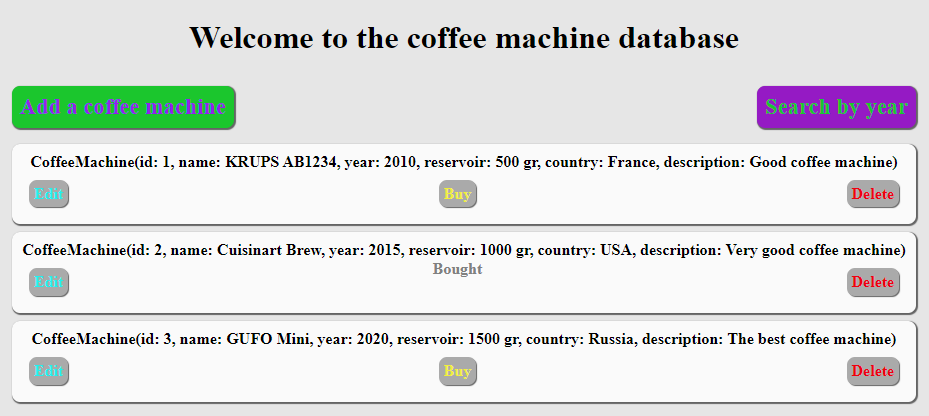
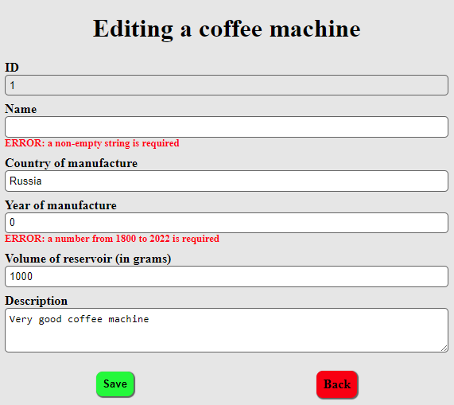

# Практическая работа №8
### Замолоцкий Семен, КИ20-17/1Б

Для 5 варианта задана сущность - кофемашина  
Для модификации выбрана работа 6  
При разработке использовался JDK17

Для сборки и запуска серверного web-приложения с помощью Gradle
ввести `gradlew.bat bootRun --args="PORT"` в cmd или
`./gradlew bootRun --args="PORT"` в bash. При первом запуске
возможна установка плагинов Gradle. Вместо PORT необходимо вписать
свободный http-порт (при опускании аргумента: 8081). После
появления INFO сообщений *Tomcat started on port(s): PORT (http)*,
можно в браузере перейти по адресу `http://localhost:PORT/` или
отправить запрос через клиентское приложение.

Для сборки и запуска клиентского приложения с помощью Gradle ввести
`gradlew.bat client -q --console=plain --args="PORT"` в cmd или
`./gradlew client -q --console=plain --args="PORT"` в bash. Вместо
PORT необходимо вписать http-порт, выбранный для сервера. В
консольном интерфейсе доступно 5 действий: CREATE, READ, UPDATE,
DELETE, READ ALL.

На главной странице можно перейти к форме добавления или к поиску
по минимальному году. После добавления объектов, будет доступны
удаление и изменение. При добавлении/изменении действуют ограничения:
поле name не должно быть пустым, значение year должно лежать в
диапазоне от 1800 до 2023. При нарушении появятся сообщения. При
нажатии кнопки Buy появится отметка о покупке. В очередь добавляется
сообщение при покупке/изменении/удалении/добавлении кофемашины.

**Название БД должно быть coffee_machines.**  
Для создания таблицы с несколькими тестовыми записями, можно
запустить скрипт create_tables.sql (например, с помощью утилиты
[sqlite](https://www.sqlite.org/download.html):
`sqlite3 coffee_machines.db -init create_tables.sql .exit`) или
вспомогательное приложение (`gradlew.bat createTables` или
`./gradlew createTables`).

#### Примеры

